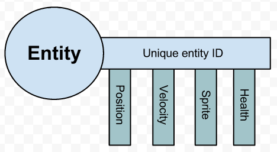
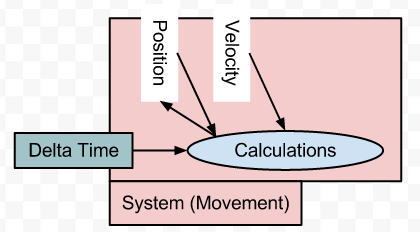

Cassandro
---
* Entity System Approach
https://www.raywenderlich.com/24878/introduction-to-component-based-architecture-in-games


The final approach I will discuss here is the Entity System approach.
The overall goal of this approach is to model your code similarly to how a relational database would do it. Imagine your game objects being a single integer ID in a database, and each component would be a row in a table.
I like using MySQL, so I like thinking about it that way. Imagine I were to look up some of the values for components of a ZapMonster in MonsterWars:

```sql
mysql> select * from health where game_object_id=1;
``

| game_object_id | cur_hp | max_hp | alive |
|----------------|:--------:|:--------:|-------:|
|  1             | 1      | 5      | 1     |


```sql
mysql> select * from move where game_object_id=1;
```
| game_object_id | vel_x | vel_y | accel_x | accel_y | max_vel | max_accel |
|----------------|-------|-------|---------|---------|---------|-----------|
|  1             | 3     | 4     | 0       | 1       | 5       | 5         |

```
mysql> select * from ai where game_object_id=1;
Empty set (0.00 sec)`
```
                                     
In other words, components would literally just be data about an object - no code at all! And each game object would be just an ID. That's the "entity" part of entity system.
On top of that, you would have systems - basically logical pieces of code that would look for objects that have a set of required components, and then do processing on them. The best description I've seen of this comes from Byte56 on this StackOverflow post:
Think of an entity like a key:


Keys also have teeth (dark blue). The teeth of our entity key is the components that make it up. You can tell entities apart by their ID, even if they have the same teeth. So what do keys fit into? Locks. Locks are our systems. For example, a movement system.


The lock only works if our key has teeth for both position and velocity. This system only processes entities that have a position and a velocity.
In the picture above, note that the System Component would work fine if an object had a Sprite Component as well - it's just that the Position and Velocity components are required.
This approach is favored by Adam Martin of t-machine.org. He has written a great number of blog posts on the subject, and has even started a Wiki about entity system achitecture.
I'm not going to show sample code for this approach yet, because this is the approach you're going to take for this tutorial, so you will see it soon enough! :]
Here is my personal opinion about this approach:

* Pros: Flexible approach with a nice separation between data and systems
* Cons: Code can get a bit long-winded and tedious at times compared to simpler approaches


Lets first try to implement one system.
In this case arendering system.

```clojure
(require '[reagent.core  :as r])
(require  '[clojure.pprint :refer [pprint]])

(def attrsPaulo
 {:Paulo/page {:elements :map}
  :Paulo/title {:text :string}
  :Paulo/textbox {:text :string}
  :Paulo/label {:text :string}
  :Paulo/panel {:elements :map}
  :Paulo/line {:elements :map}})


(def a-page (r/atom {
                     :page1    {:graphicL {:type :Paulo/page :map [:title1 :panel1]}}
                     :title1   {:graphicL {:type :Paulo/title :text "Titulo Paulo"}}
                     :panel1   {:graphicL {:type :Paulo/panel :map [:line1 :line2]}}
                     :line1    {:graphicL {:type :Paulo/line :map [:label1 :textbox1]}}
                     :line2    {:graphicL {:type :Paulo/line :map [:label2 :textbox2]}}
                     :label1   {:graphicL {:type :Paulo/label :text "first name"}}
                     :textbox1 {:graphicL  {:type :Paulo/textbox :text "1"}
                                :buisnessL {:link :person/firstname}}
                     :label2   {:graphicL {:type :Paulo/label :text "last name"}}
                     :textbox2 {:graphicL {:type :Paulo/textbox :text ""}
                                :buisnessL {:link  :person/lasttname}}}))

```

render2* only cares about the entities that have a component :graphicL

```clojure
(defmulti render2* (fn [id atom]  (:type (:graphicL (id atom)))))


(defmethod render2* :Paulo/page [id data-atom]
  [:div 
   (map (fn [id2] (render2* id2 data-atom)  )  (:map (:graphicL (id  data-atom)) ))
])

(defmethod render2* :Paulo/title [id data-atom]
    [:h1  
     (:text (:graphicL(id data-atom)))
        ])

(defmethod render2* :Paulo/panel [id data-atom]
   [:div
       (map (fn [id] (render2* id data-atom)) (:map (:graphicL (id  data-atom)) ))
     ;"(map (fn [id] (render2 id data-atom) ) (:map (id  data-atom)) )"
   ])

(defmethod render2* :Paulo/label [id data-atom]
   [:div  
      (:text (:graphicL (id  data-atom))) 
    ])

(defmethod render2* :Paulo/line [id data-atom]
    [:div 
     (map (fn [id] (render2* id data-atom)) (:map (:graphicL (id  data-atom))) )
    ])

(defmethod render2* :Paulo/textbox [id data-atom]
   [:input 
          {:value (:text (:graphicL (id  data-atom)))}
           
      ])
      
 (defmethod render2* :default [id data-atom]
    [:div
            [:div {:style  {:background-color "red"}}
              [:h1 "OPPS Error at    " id  ]
              [:h2 (if (= nil (id data-atom)) 
                       "id not found" 
                       (with-out-str (print "the type is not implemented " (:type (:graphicL (id data-atom))))) ) ]  
            ]
            [:div
              [:span {:font-weight :bold} "Data Atom"]
              [:code [:pre {:style {:white-space :wrap}}
                         (with-out-str (pprint data-atom))]]]])
   
   
(render2*  :page1 @a-page)


(defn ^:export run3* []
   (r/render [(fn[] (render2*  :page1 @a-page))]
              (js/document.getElementById "app")))
              

;a data example
(def person-list (r/atom {:id0 {
                                :person/person
                                    {:person/firstname "Renate"
                                     :person/lastname "Chasman"
                                     :person/birthday "1932-01-10"}
                               } 
                           :id1 {
                               :person/person
                                   {:person/firstname "Renate"
                                    :person/lastname "Chasman"
                                    :person/birthday "1932-01-10"}
                              }   
                              :id2 {
                                  :person/person
                                      {:person/firstname "Renate"
                                       :person/lastname "Chasman"
                                       :person/birthday "1932-01-10"}
                                 } 
                             :id3 {
                                 :person/person
                                     {:person/firstname "Renate"
                                      :person/lastname "Chasman"
                                      :person/birthday "1932-01-10"}
                                } 
                            :id4 {
                                :person/person
                                    {:person/firstname "Renate"
                                     :person/lastname "Chasman"
                                     :person/birthday "1932-01-10"}
                               } 
                           :id5 {
                               :person/person
                                   {:person/firstname "Renate"
                                    :person/lastname "Chasman"
                                    :person/birthday "1932-01-10"}
                              } 
                           :id6 {
                               :person/person
                                   {:person/firstname "Renate"
                                    :person/lastname "Chasman"
                                    :person/birthday "1932-01-10"}
                              } 
                          :id7 {
                              :person/person
                                  {:person/firstname "Renate"
                                   :person/lastname "Chasman"
                                   :person/birthday "1932-01-10"}
                             } 
                            
                         }))
                         
    ;0->n              
;(take 4 (second (split-at 0 @person-list)))
 
 ;data entities- buiness logic
 (def dat1 (map (fn[p] {(key p)   {:buinessL (val p)  }} ) (take 4 @person-list)))
 
 
;layout
;(keyword (str "label" k) )
;graphic enties conected with buiness
(defn ppil [elem] 
         (let [
               k (key (first elem))
               m (first (vals elem))
               ]
            [   
           {k    
              (assoc-in 
                  m 
                  [:buinessL :graphicL] 
                  {:type :Paulo/line  :map [(keyword (str "label_" (name k)) )
                                            (keyword (str "textbox_" (name k)) )
                                             ] })}
              {(keyword (str "label_" (name k)) )   {:graphicL {:type :Paulo/label :text "last name"}}}    
              {(keyword (str "textbox_" (name k)) )  {:graphicL  {:type :Paulo/textbox :text "1"}
                                                      :buisnessL {:link k}}
              }      
             ]       
                  ))
                  
                  
(ppil (first dat1))

(def bp2 (reduce into {}  (map ppil dat1)))

;(flatten (map ppil dat1))


(reduce into {} [{:dog :food} {:cat :chow}])
;;=> {:dog :food, :cat :chow}


                         
```
lets initialize with this data.
This means generate the UI data.

```clojure

(defmulti gen-ecs (fn [attrs path] (:type (get attrs (last path)))))

(defmethod gen-ecs :string [attrs path]
 {:input :textedit :label (name (last path)) :path path})
 
;there are two languages one for the UI and another for the data
;this part is specific
(defn create-page [title]
    {:page1  {:type :Paulo/page 
              :map [:title1 ]}
     :title1 {:type :Paulo/title 
              :text (str title)}
    }
 )
 
 
 
(defn create-panel-data-persons [page data-atom]
(for [a @person-list] (pprint a))
 (assoc page  
  :panel {:type :Paulo/panel :text "Titulo Paulo"}
 )
 
    :panel1 {:type :Paulo/panel :map [:line1 :line2]}
                      :line1 {:type :Paulo/line :map [:label1 :textbox1]}
                      :line2 {:type :Paulo/line :map [:label2 :textbox2]}
                      :label1 {:type :Paulo/label :text "first name"}
                      :textbox1 {:type :Paulo/textbox :text "1" :buisnessL :person/firstname }
                      :label2 {:type :Paulo/label :text "last name"}
                      :textbox2 {:type :Paulo/textbox :text "" :buisnessL :person/lasttname}
)


 ```
